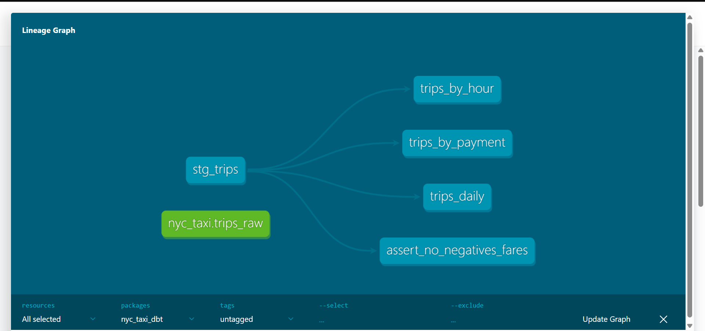

# NYC Taxi Data Project

This repository documents my progression through a real-world data engineering workflow using NYC Yellow Taxi trip data. It starts with raw data cleaning in pandas and SQL, then rebuilds the transformation layer using dbt and BigQuery — the way it would be done on a professional data team.

---

## The progression

### Stage 1 — pandas + SQLite + SQL
The first stage focuses on the fundamentals. Raw parquet data is cleaned using pandas, loaded into a local SQLite database, and analyzed with SQL queries. Visualizations are produced with matplotlib.

**Skills:** pandas, SQL, SQLite, matplotlib, Jupyter

**What it covers:**
- Loading and exploring raw NYC Taxi parquet data (~3M rows)
- Identifying and fixing data quality issues (nulls, outliers, bad date ranges)
- Deriving new columns (trip duration in minutes)
- Analytical SQL queries — trips per day, peak hours, tip behaviour by payment type
- Visualizing results in a Jupyter notebook

---

### Stage 2 — dbt + BigQuery
The second stage rebuilds the transformation layer professionally. The same cleaning logic and analytical queries from Stage 1 are rewritten as dbt models on top of BigQuery — with automated data tests and auto-generated documentation.

**Skills:** dbt, BigQuery, SQL, data modeling, data testing, documentation

**What it covers:**
- Staging model that cleans and renames raw data
- Mart models for daily trips, peak hours, and payment analysis
- Schema tests (not_null, unique, accepted_values) on every key column
- A custom SQL test asserting no negative fares
- Auto-generated dbt documentation with full lineage graph

---

## Data lineage



The pipeline flows in this order:

```
BigQuery (trips_raw)
    └── stg_trips (view)
            ├── trips_daily (table)
            ├── trips_by_hour (table)
            └── trips_by_payment (table)
```

Staging models are materialized as **views** — lightweight and always fresh. Mart models are materialized as **tables** — optimized for query performance.

---

## Data cleaning steps

| Issue | Fix |
|---|---|
| `passenger_count` of 0 or null | Dropped |
| `trip_distance` of 0 or over 100 miles | Dropped |
| Negative `fare_amount` | Dropped |
| Trips outside January 2025 | Dropped |
| Negative or 3hr+ trip durations | Dropped |
| Derived column `trip_duration_minutes` | Added |

Approximately 15% of rows were removed during cleaning.

---

## Key findings

- Trip volume peaks sharply during **morning and evening rush hours**
- **Credit card** payments account for nearly all recorded tips — cash tips are not captured digitally
- A small number of pickup location IDs account for a disproportionate share of all trips
- Average fares are consistent across passenger counts — distance drives fare more than group size

---

## Project structure

```
nyc-taxi-pipeline/
├── v1_pipeline/
|   ├── data/
|   |   ├── nyc_taxi.db              # SQLite database (not tracked by Git)
|   |   ├── yellow_tripdata_2025-01.parquet  # Raw data (not tracked by Git)
|   |   ├── yellow_tripdata_cleaned.parquet  # Cleaned data (not tracked by Git)
│   └── nyc_taxi.ipynb               # pandas cleaning, SQLite, SQL queries, visualizations
├── v2_dbt/
│   ├── models/
│   │   ├── staging/
│   │   │   ├── stg_trips.sql        # Cleans and renames raw data
│   │   │   ├── stg_trips.yml        # Column descriptions and schema tests
│   │   │   └── sources.yml          # Points dbt to the raw BigQuery table
│   │   └── marts/
│   │       ├── trips_daily.sql      # Trips and fares aggregated by day
│   │       ├── trips_by_hour.sql    # Trips and fares aggregated by hour
│   │       ├── trips_by_payment.sql # Trips and tip % by payment type
│   │       └── marts.yml            # Column descriptions and schema tests
│   ├── tests/
│   │   └── assert_no_negative_fares.sql  # Custom data quality test
│   ├── analyses/
│   ├── assets/
|   |   ├── lineage.png                  # dbt lineage graph
│   ├── macros/
│   ├── seeds/
│   ├── snapshots/
│   ├── dbt_project.yml              # dbt configuration
│   ├── profiles.yml.example         # Connection config template
├── .gitignore
├── LICENSE
└── README.md                        # This file
└── requiremts.txt
```

---

## Setup

### Stage 1 — pandas + SQLite

**Install dependencies:**
```bash
pip install pandas pyarrow matplotlib jupyter
```

**Download the data:**

Go to [nyc.gov/site/tlc/about/tlc-trip-record-data.page](https://www.nyc.gov/site/tlc/about/tlc-trip-record-data.page) and download the Yellow Taxi parquet file for January 2025. Place it in the `v1_pipeline/` folder.

**Run the notebook:**
```bash
cd v1_pipeline
jupyter notebook
```

Open `nyc_taxi.ipynb` and run all cells.

---

### Stage 2 — dbt + BigQuery

**Install dbt:**
```bash
pip install dbt-bigquery
```

**Set up BigQuery:**
- Create a Google Cloud project at [console.cloud.google.com](https://console.cloud.google.com)
- Enable the BigQuery API
- Create a dataset called `nyc_taxi`
- Upload your cleaned parquet file as a table called `trips_raw`

**Configure your profile:**
```bash
cd v2_dbt
cp profiles.yml.example profiles.yml
```

Edit `profiles.yml` and replace `your-gcp-project-id` with your actual project ID.

**Authenticate:**
```bash
gcloud auth application-default login
```

**Run the pipeline:**
```bash
dbt build
```

All models will be created and all tests will run. You should see everything passing.

**View documentation:**
```bash
dbt docs generate
dbt docs serve
```

Opens at `http://localhost:8080`.